# Temple Bridge Human Center

Temple Bridge Human Center is a mobile-first cultural guide for Maple Bridge, Hanshan Temple, Tieling Pass, and the Grand Canal. The published site combines route guidance, cultural stories, community check-ins, profile progress, and an AI guide.

## User Operation Guide

The interface screenshots in this README are provided as PNG images to keep text, icons, and interface edges clear. BMP is intentionally avoided because it creates unnecessarily large documentation assets. Several screenshots are long-scroll captures; if a floating element such as the AI guide appears repeated or fixed in the capture, that is only a screenshot artifact. In the live website, the AI guide remains responsive and does not cause the page to freeze or stutter.

### 1. Global Navigation

**Page / Area:** Fixed top bar, fixed bottom tab bar, floating music control, and AI guide launcher.

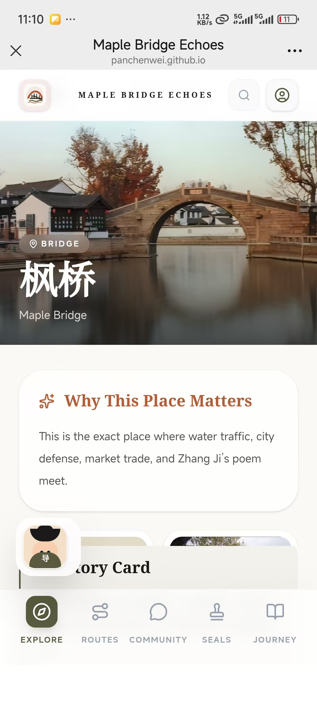

Visible controls and interactions:

- `MAPLE BRIDGE ECHOES`: site title in the top bar. It is visual branding only and is currently a placeholder for navigation.
- Search icon button, accessible label `Open search`: opens the Search Guide overlay and closes the AI guide panel if it is open.
- User/Profile icon button, accessible label `Open profile` or `Log in or register`: opens the Journey/Profile page. If the visitor is not signed in, the account form appears.
- Bottom tab `Explore`: switches to the Explore page.
- Bottom tab `Routes`: switches to the Routes page.
- Bottom tab `Community`: switches to the Community page.
- Bottom tab `Seals`: switches to the Calligraphy Seals page.
- Bottom tab `Journey`: switches to the Journey/Profile page.
- Floating play/pause icon button: toggles the background music. On the Explore page it appears over the hero image; on other pages it appears above the bottom navigation. It shows short status text such as `Music on`, `Music paused`, or `Add music file first`.
- Floating AI guide button `枫桥小导游` / `Ask AI`: opens the AI guide panel.
- There is no hamburger mobile menu, anchor navigation menu, or contact link in the current source. Mobile users use the same top buttons and bottom tab bar.

### 2. Explore Page

**Page / Area:** Main entry page with hero text, Maple Bridge image, spot buttons, route cards, and cultural insight cards.

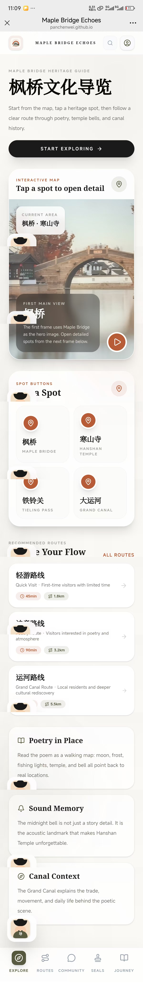

Visible controls and interactions:

- `Start Exploring`: switches to the Routes page.
- Hero music icon button, accessible label `Play background music` or `Pause background music`: plays or pauses `/audio/maple-bridge-bgm.mp3`.
- Spot button `枫桥` / `Maple Bridge`: opens the Maple Bridge detail overlay and marks that spot as visited.
- Spot button `寒山寺` / `Hanshan Temple`: opens the Hanshan Temple detail overlay and marks that spot as visited.
- Spot button `铁铃关` / `Tieling Pass`: opens the Tieling Pass detail overlay and marks that spot as visited.
- Spot button `大运河` / `Grand Canal`: opens the Grand Canal detail overlay and marks that spot as visited.
- `All Routes`: switches to the Routes page.
- Route card `轻游路线` / `Quick Visit`: switches to the Routes page. It does not open this specific route directly from the Explore page.
- Route card `诗意路线` / `Poetry Route`: switches to the Routes page. It does not open this specific route directly from the Explore page.
- Route card `运河路线` / `Grand Canal Route`: switches to the Routes page. It does not open this specific route directly from the Explore page.
- Cultural cards `Poetry in Place`, `Sound Memory`, and `Canal Context`: informational cards only, currently not clickable.
- Hover and tap effects: spot buttons and route cards change shadow, border, scale, or arrow position. Cards animate into view with Motion.

### 3. Spot Detail Overlay

**Page / Area:** Full-screen detail overlay opened from a spot button or search result.

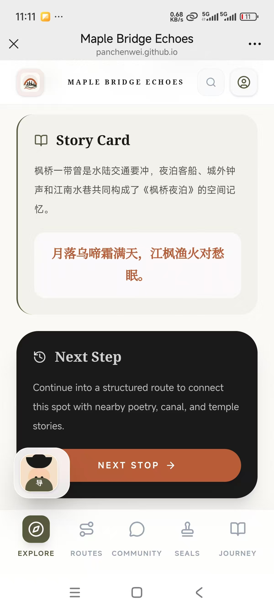

Visible controls and interactions:

- `BACK`: closes the spot detail overlay and returns to the Explore page.
- `Next Stop`: closes the detail overlay and switches to the Routes page.
- `Old Memory` and `Now Scene` images: static comparison images for the selected spot.
- `Why This Place Matters` and `Story Card`: static story sections. If the selected spot has a poem, the poem appears inside the story card.
- Opening a spot updates the AI guide context to that specific place.

### 4. Search Guide Overlay

**Page / Area:** Full-screen search panel opened from the top search icon.

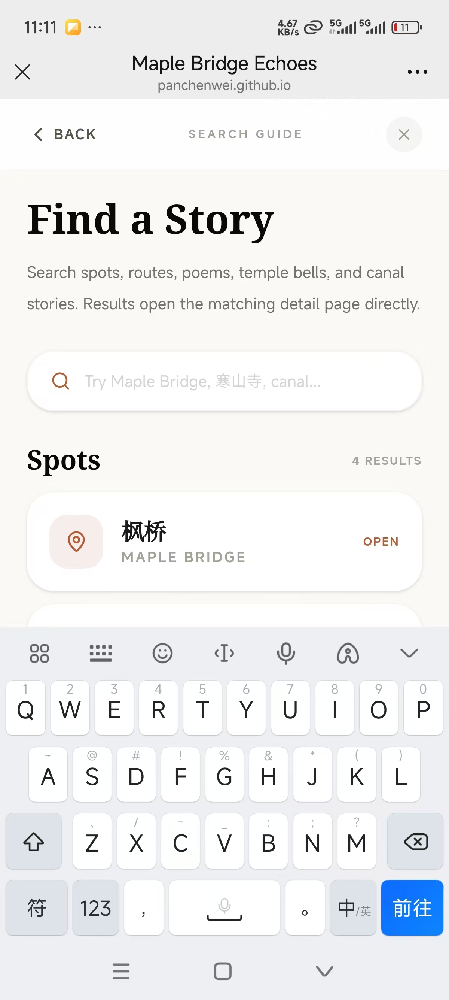

Visible controls and interactions:

- `Back`: closes the search overlay.
- Close icon button, accessible label `Close search`: closes the search overlay.
- Search input with placeholder `Try Maple Bridge, 寒山寺, canal...`: filters spot and route results as the user types.
- Spot result cards with `Open`: open the matching spot detail overlay on the Explore page.
- Route result cards with `Open`: switch to the Routes page and open the matching route detail overlay.
- Result counters such as `4 results` or `3 results`: update with the current query and are read-only.
- Hover effect: result cards lift slightly and gain a stronger shadow.

### 5. Routes Page

**Page / Area:** Route list, journey score summary, and route tip.

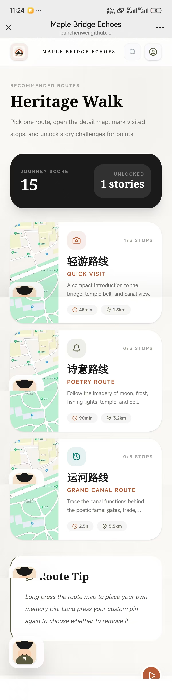

Visible controls and interactions:

- Route card `轻游路线` / `Quick Visit`: opens the Quick Visit route detail overlay.
- Route card `诗意路线` / `Poetry Route`: opens the Poetry Route detail overlay.
- Route card `运河路线` / `Grand Canal Route`: opens the Grand Canal Route detail overlay.
- The route cards show duration, distance, and visited stop count. These values are read-only.
- `Journey Score` and `Unlocked stories`: progress summary, read-only.
- `Route Tip`: explains the map long-press memory pin interaction. It is static text.
- Hover and tap effects: route cards lift, gain shadow, and animate into view.

### 6. Route Detail And Map

**Page / Area:** Full-screen route detail overlay with AMap route map, landmarks, progress, and navigation links.

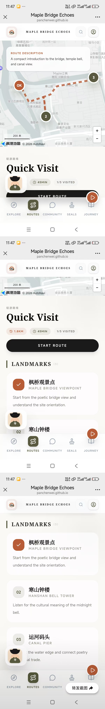

Visible controls and interactions:

- `BACK`: closes the route detail overlay and returns to the Routes page.
- AMap/Gaode map: supports normal map pan and zoom gestures. The map includes AMap Scale and ToolBar controls when the AMap script loads successfully.
- Numbered route markers `1`, `2`, `3`: select the matching landmark and scroll the landmark card into view.
- Marker label `OK`: appears after a stop has been marked visited.
- Long press on the map for about 600 ms: places a custom memory pin.
- Long press a custom memory pin: opens the `Cancel marker?` menu.
- `Remove`: deletes the selected custom memory pin.
- `Keep`: closes the custom pin removal menu and leaves the pin on the map.
- `Start Route`: selects the first landmark and changes the button state.
- `Continue Route`: appears after the route has been started and selects the first landmark again.
- Landmark cards: clicking a card selects it and expands its story details.
- `Mark Visited`: marks the selected landmark as visited.
- `Visited`: shown after a landmark has been marked visited. Clicking it has no new effect beyond keeping the visited state.
- `Unlock Story`: opens the Story Game modal for the selected landmark and closes the AI guide panel.
- `Story Unlocked`: shown after the challenge is completed. It can still open the Story Game replay, but points are not added twice.
- `Open AMap Navigation`: opens an external AMap walking navigation URL in a new tab or native AMap flow when supported.
- If the map service is unavailable, the map area shows a `Map key needed` fallback message instead of the interactive map.

### 7. Story Game Modal

**Page / Area:** Quiz modal opened from `Unlock Story` or `Story Unlocked` inside a route landmark.

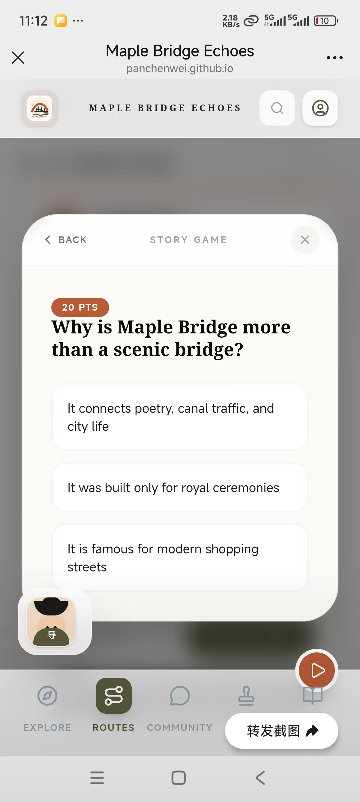

Visible controls and interactions:

- `Back`: closes the Story Game modal.
- Close icon button: closes the Story Game modal.
- `Accept Challenge`: moves from the intro state to the question state.
- Answer option buttons: each route challenge has three visible answer buttons. A wrong answer shows `Try again` and resets after a short delay. A correct answer unlocks the reward state.
- Possible answer button text includes `It connects poetry, canal traffic, and city life`, `It was built only for royal ceremonies`, `It is famous for modern shopping streets`, `88`, `108`, `365`, `Grain transport, markets, and daily movement`, `A private royal swimming pool`, `Only modern sightseeing boats`, `江枫渔火对愁眠`, `白日依山尽`, `春眠不觉晓`, `Homesickness and quiet distance`, `Festival excitement`, `Battle victory`, `夜半钟声到客船`, `姑苏城外寒山寺`, `月落乌啼霜满天`, `Waterway defense and route control`, `Imperial garden design`, `Modern subway planning`, `Because canal traffic brought grain and merchants`, `Because there was no water transport`, `Because the area was closed to visitors`, `As a living network behind local stories`, `As a decorative pond`, and `As a single isolated scenic spot`.
- `Claim & Return`: closes the modal after the cultural record is shown.
- If the story was already completed, the modal displays `This story is already unlocked. You can replay it, but points will not be added twice.`
- Reward messages include `+20 points added`, `+25 points added`, `+30 points added`, or `Already completed`, depending on the challenge and progress state.

### 8. Calligraphy Seals Page

**Page / Area:** Seals mini games, poem character puzzle, Han Shan and Shi De story, and progress statistics.

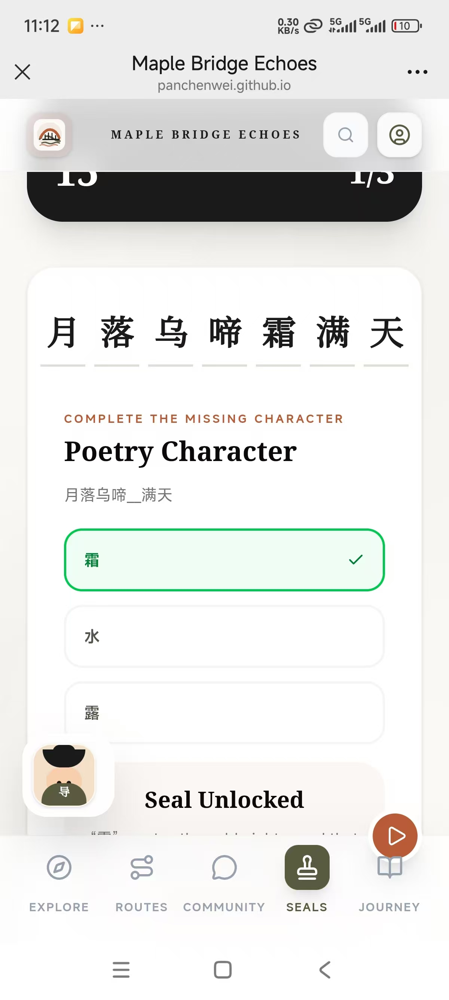

Visible controls and interactions:

- Challenge selector `Poetry Character`: switches to the missing-character quiz.
- Challenge selector `Midnight Bell`: switches to the temple bell quiz.
- Challenge selector `Canal Function`: switches to the canal history quiz.
- Answer buttons for `Poetry Character`: `霜`, `水`, `露`.
- Answer buttons for `Midnight Bell`: `Dawn`, `Noon`, `Midnight`.
- Answer buttons for `Canal Function`: `Trade and transport`, `Only fishing`, `Only palace gardens`.
- Correct answers show `Seal Unlocked` and add points once. Replaying a completed challenge shows `Already scored`.
- Wrong answers show `Try again` and reset after a short delay.
- Challenge selector cards show either `Unlocked` or the point value, such as `15 pts` or `20 pts`.
- Han Shan and Shi De image: changes from grayscale to color on hover.
- Stats cards `Visited`, `Stories`, `Seals`, and `Score`: read-only progress values.

### 9. Community Page

**Page / Area:** Community check-in composer, post list, comments, image upload, and message entry points.

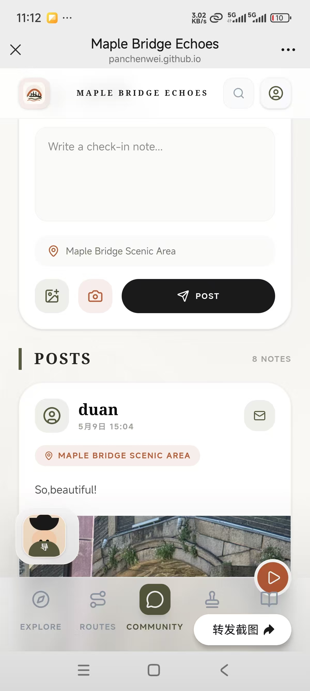

Visible controls and interactions:

- Refresh icon button, accessible label `Refresh community posts`: reloads community posts.
- Textarea `Write a check-in note...`: writes the post content.
- Location input with default text `Maple Bridge Scenic Area`: edits the post location.
- Image upload icon button: opens file selection for an image.
- Camera icon button: opens camera capture on supported mobile devices.
- Remove selected image icon button, accessible label `Remove selected image`: removes the selected post image.
- `Post`: submits the check-in. If the visitor is not signed in, the inline account form is shown.
- `Posting`: temporary disabled button state while the post request is in progress.
- Message icon button, accessible label `Message {authorName}`: opens the private message panel for another user. If the post belongs to the current user, the page shows `This is your own post`.
- Comment input `Write a comment...` or `Log in to comment`: writes a comment for a post.
- Send comment icon button, accessible label `Send comment`: submits the comment. If the visitor is not signed in, the inline account form is shown.
- Empty state `No check-ins yet`: shown when there are no posts.
- Loading state `Loading community...`: shown while posts are loading.
- Posted cards animate into view with Motion.

### 10. Private Message Area

**Page / Area:** Private message composer opened from a Community post/comment or from Profile inbox conversations.

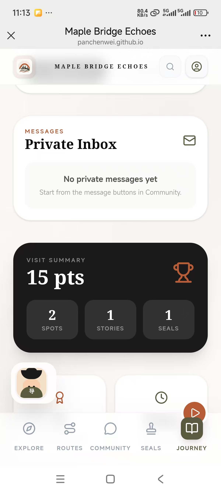

Visible controls and interactions:

- Close icon button, accessible label `Close private message`: closes the Community private message panel.
- Textarea `Say hello...`: writes a new private message from the Community page.
- `Send Message`: sends the private message.
- `Sending`: temporary disabled state while the message request is in progress.
- In the Profile inbox, conversation buttons open an existing chat.
- Profile chat close icon, accessible label `Close chat`: closes the active chat.
- Input `Write a private message...`: writes a reply inside the active chat.
- Send private message icon button, accessible label `Send private message`: sends the chat reply.
- Chat states `Loading...` and `No messages in this chat yet.` are read-only status messages.

### 11. Account Form

**Page / Area:** Login/register form shown on the Journey page when signed out and inline in Community when a signed-out user tries to post, comment, or message.

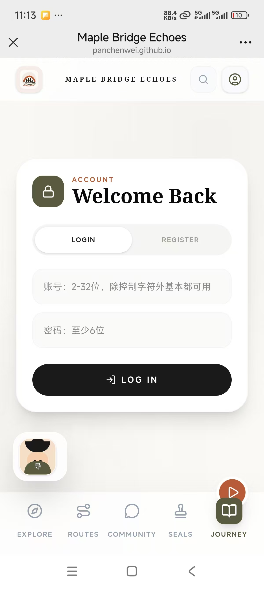

Visible controls and interactions:

- Segmented button `login`: switches the account form to login mode.
- Segmented button `register`: switches the account form to registration mode.
- Username input with placeholder `账号：2-32位，除控制字符外基本都可用`: accepts the account name.
- Display name input with placeholder `展示名：2-24位，支持中英文和常见符号`: visible only in register mode.
- Password input with placeholder `密码：至少6位`: accepts the password.
- `Log in`: submits login credentials.
- `Register`: submits registration details and signs the user in on success.
- `Please wait`: temporary disabled submit state while the request is in progress.
- Error messages appear below the inputs when the API rejects the request.

### 12. Journey/Profile Page

**Page / Area:** Signed-in personal journey page with profile editing, inbox, progress, profile mini game, sharing, and saving.

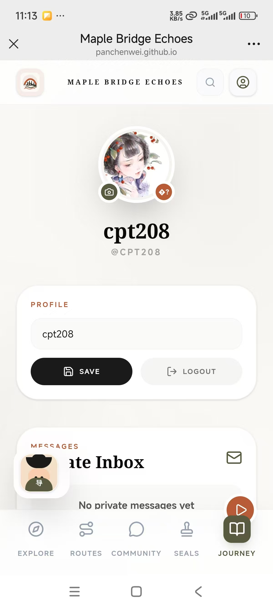

Visible controls and interactions:

- Avatar camera icon button: selects a new profile avatar image. Images larger than 4 MB show `Image must be smaller than 4MB`.
- Display name input: edits the profile display name.
- `Save`: saves the profile display name and avatar.
- `Logout`: signs out the current user and returns the profile area to the account form.
- Conversation buttons in `Private Inbox`: open a chat with that participant.
- Chat close icon, accessible label `Close chat`: closes the active chat.
- Chat input `Write a private message...`: writes a reply.
- Chat send icon, accessible label `Send private message`: sends the reply.
- `Profile Mini Game` answer buttons: `Midnight bell`, `Modern skyline`, and `Desert wind`. The correct answer adds `+10 points` once; replays show `Already scored`.
- `Share`: uses the Web Share API when available. If unavailable, it copies the journey summary to the clipboard. Status text may show `Shared successfully`, `Summary copied to clipboard`, or `Share cancelled`.
- `Save`: in the favorite quote card, downloads `maple-bridge-journey.txt` and shows `Memory file saved`.
- Summary cards `Spots`, `Stories`, `Seals`, `Achievements`, and `Walk Time`: read-only progress values.

### 13. AI Guide Panel

**Page / Area:** Floating AI assistant for current page, spot, route, or landmark context.

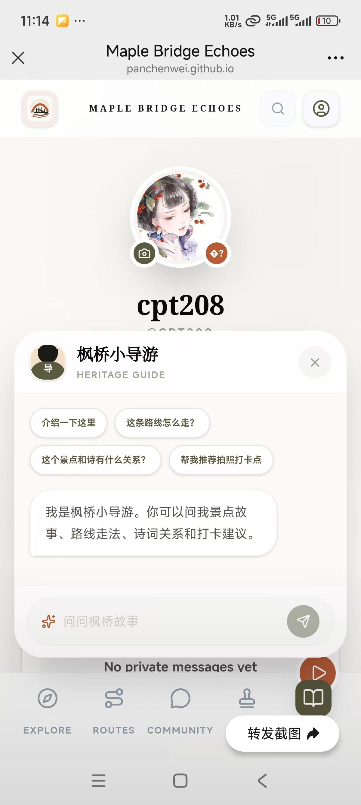

Visible controls and interactions:

- Launcher `枫桥小导游` / `Ask AI`: opens the panel.
- Close icon button, accessible label `Close AI guide`: closes the panel.
- Quick prompt `介绍一下这里`: sends that prompt to the AI guide.
- Quick prompt `这条路线怎么走？`: sends that prompt to the AI guide.
- Quick prompt `这个景点和诗有什么关系？`: sends that prompt to the AI guide.
- Quick prompt `帮我推荐拍照打卡点`: sends that prompt to the AI guide.
- Input `问问枫桥故事`: writes a custom message, up to 500 characters.
- Send icon button, accessible label `Send AI guide message`: sends the custom message. It is disabled when the input is empty or the AI request is loading.
- Loading state `小导游正在整理答案`: shown while waiting for a reply.
- The panel scrolls to the newest message. Its context label changes based on the active page, selected spot, route, or landmark.
- Opening search or a route story challenge can force-close the AI guide to keep the overlay clear.

## Technologies Used

### Frontend Application

- Framework: React 19 with React DOM, organized as a single-page application controlled by React state in `App.tsx`.
- Language: TypeScript and TSX are used for component props, data models, route markers, user profiles, community posts, direct messages, and AI guide context.
- View structure: the app switches between `Explore`, `Routes`, `Community`, `Seals`, and `Journey` through the `AppView` enum instead of a router library.
- Main layout: `TopBar`, `BottomNav`, `SearchOverlay`, and `AiGuideWidget` stay outside the active page view so they can remain available across the whole site.
- Component architecture: major user-facing areas are split into `ExploreView`, `SpotDetailView`, `RoutesView`, `RouteDetailView`, `StoryGame`, `StampsView`, `CommunityView`, `ProfileView`, and `AuthGate`.

### UI, Styling, And Interaction

- Styling system: Tailwind CSS v4 is integrated through `@tailwindcss/vite`.
- Design tokens: `src/index.css` defines the heritage paper, ink, red, and olive colors, plus serif and sans-serif font stacks.
- Custom CSS utilities: `xuan-paper`, `glass-nav`, `poem-box`, `vertical-text`, `olive-green`, and `hide-scrollbar` support the Jiangnan ink-paper visual style.
- Map styling: AMap marker classes such as `amap-route-marker`, `amap-route-marker-selected`, `amap-route-marker-visited`, and `amap-user-pin-menu` style route stops and custom memory pins.
- Animation library: `motion/react` is used for overlay transitions, route cards, spot buttons, search panels, quiz rewards, AI guide opening and closing, and lightweight tap feedback.
- Icon system: `lucide-react` supplies interface icons such as search, user, route, stamp, camera, mail, send, navigation, play, pause, and close.
- Utility helpers: `clsx` and `tailwind-merge` are combined in the local `cn` helper to merge conditional Tailwind class names safely.

### Content, Media, And Assets

- Image assets: scenic, route, profile, story, and summary images are stored under `public/images`.
- Audio asset: the background music uses `public/audio/maple-bridge-bgm.mp3`.
- Icon asset: the top-bar brand mark uses `public/bridge-icon.svg`.
- Asset path handling: `publicAsset()` reads Vite's base path and keeps public assets working under the published site path.
- Image resilience: `ImageWithFallback` replaces missing or failed images with a styled visual fallback instead of leaving broken image icons.
- README screenshots: documentation screenshots are PNG files under `docs/screenshots`; PNG is used for sharper UI text, while BMP is avoided because it is too large for practical documentation.

### Map And Route Navigation

- Map provider: Gaode/AMap JavaScript API v2 powers the route detail map.
- AMap plugins: Scale, ToolBar, and Walking are requested by the map loader.
- Route rendering: route markers are created from `ROUTES_DATA`, and the walking path is drawn as a dashed polyline.
- Marker interaction: clicking a route marker selects the matching landmark card and scrolls it into view.
- Visit progress: visited route markers are visually changed to an `OK` state and recorded in journey progress.
- Custom memory pins: long pressing the map creates a user memory pin; long pressing that pin opens `Remove` and `Keep` actions.
- External navigation: `Open AMap Navigation` creates a `uri.amap.com/navigation` walking-navigation link for the selected landmark.
- Map fallback: if the AMap script or key is unavailable, the map panel shows a clear `Map key needed` fallback message.

### User State And Progress

- Journey progress: score, completed challenges, visited spots, unlocked stories, and collected stamps are stored in browser `localStorage`.
- Auth token: the browser stores the session token in `localStorage` under a project-specific key.
- Spot visits: opening spot details marks a heritage spot as visited.
- Route challenges: story quizzes add points, stamps, and unlocked story records only once per challenge.
- Profile mini game: the Journey page has a separate one-time scoring question.
- Share and save actions: the Journey page uses the Web Share API when available, falls back to clipboard copying, and can generate a text summary file.

### Backend And API

- Server framework: Express 4 handles authentication, profile updates, community posts, comments, private messages, uploaded media, and AI chat requests.
- Data storage: server-side JSON files store users, sessions, community posts, comments, and direct messages.
- Upload handling: uploaded avatar and post images are accepted as data URLs and saved under server upload folders.
- Password handling: passwords are salted and hashed with Node.js `crypto.pbkdf2Sync`.
- Session handling: login and registration create session tokens; logout removes the current session.
- Validation: request bodies, IDs, usernames, display names, comments, posts, messages, AI context, and uploaded image sizes are validated server-side.
- Rate limiting: separate in-memory request buckets limit authentication, write, and AI requests.
- Security headers: the server disables the Express signature and sets response headers such as `X-Content-Type-Options`, `Referrer-Policy`, and `X-Frame-Options`.
- CORS: the server allows configured origins for browser API calls.
- Live API origin: the published frontend points API requests to `https://api2.pa1018.cn`.

### AI Guide

- AI feature: the floating guide sends the current page, spot, route, or landmark context with the user's question.
- Prompt behavior: the server prompt asks the guide to answer as `枫桥小导游`, prioritize the current page data, and avoid inventing unsupported real-time facts.
- API style: the server sends chat requests to an external AI API and returns the generated guide response to the frontend.
- Response handling: AI responses are normalized into plain text before being returned to the frontend.
- Source variables: the server references AI key, model, and endpoint settings, but their values and provider details are intentionally not shown in the public README.

### Build And Tooling Stack

- Build foundation: Vite 6 is used with `@vitejs/plugin-react` and `@tailwindcss/vite`.
- Type checking: TypeScript configuration files cover the client and server code.
- Server TypeScript tooling: `tsx` is included for TypeScript-based server execution workflows.
- Package metadata: `package.json` and the lockfile record the exact dependency graph used by the project.
- Included but not actively used in current source: `react-markdown` and an unused AI SDK dependency listed in the package metadata.
- Not used: Three.js, React Router, Redux/Zustand, Leaflet, Mapbox, and in-app Markdown rendering.
- Frontend environment names referenced by source: `VITE_API_BASE_URL`, `VITE_AMAP_KEY`, and `VITE_AMAP_SECURITY_JS_CODE`.
- Server environment names referenced by source: AI key, model, endpoint, and `PORT` settings.

## Project Structure

```text
src/
  App.tsx
  components/
    AiGuideWidget.tsx
    AmapRouteMap.tsx
    AuthGate.tsx
    BottomNav.tsx
    CommunityView.tsx
    ExploreView.tsx
    ProfileView.tsx
    RouteDetailView.tsx
    RoutesView.tsx
    SearchOverlay.tsx
    SpotDetailView.tsx
    StampsView.tsx
    StoryGame.tsx
    TopBar.tsx
  lib/
    amap.ts
    api.ts
    assets.ts
    utils.ts
  types.ts
public/
  audio/
  images/
  bridge-icon.svg
server/
  index.ts
docs/
  screenshots/
  SCREENSHOT_GUIDE_ZH.md
```

## Notes

- The screenshot paths above are placeholders for actual PNG captures.
- Existing visual assets include JPG, BMP, SVG, and MP3 files, but README screenshots should use PNG.
- The current app has no visible contact link, no anchor-navigation section list, and no separate mobile menu.
